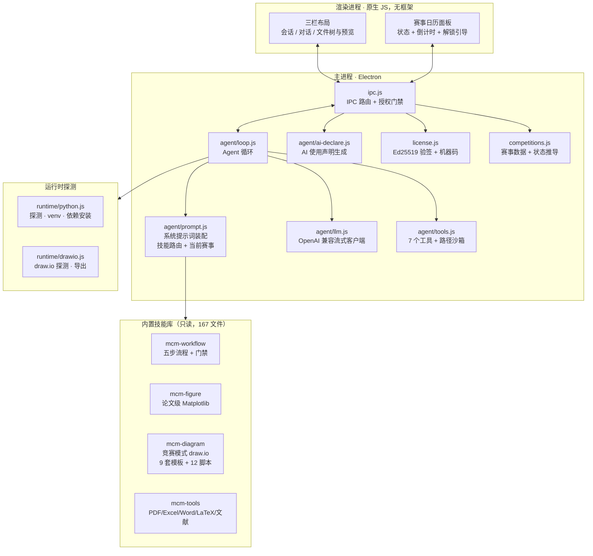

<h1 align="center">阿一古数模</h1>

<p align="center">
  把数学建模竞赛从「赛题」做到「能交的论文」的 Windows 桌面应用。<br/>
  自填 API Key、自选模型；代码在你本机真实运行，论文里的每个数字都能追到结果文件。
</p>

<p align="center">
  <a href="https://github.com/SpenBug/mcm-agent/releases/latest"></a>
  <a href="https://github.com/SpenBug/mcm-agent/releases"></a>
  <a href="LICENSE"></a>
  
  
</p>

<p align="center">
  
</p>

---

## 一、它解决什么

| 常见痛点 | 阿一古数模的做法 |
|---|---|
| 论文里的数是「编」出来的 | Agent 在你本机**真实运行代码**，图表与结论都来自实际计算结果 |
| 流程图用 Matplotlib 手绘，不可编辑、不像竞赛图 | 走**竞赛模式**产出可编辑 `.drawio` + 矢量 PDF |
| 模型由客户端统一决定 | 设置页自填 API Key / Base URL / 模型，兼容任何 OpenAI 协议网关 |
| 环境要自己配 | 内置 Python 环境自检与一键安装（装到应用私有目录，不污染系统） |
| **AI 使用声明漏了被取消评奖资格** | 内置合规生成器，按赛事规定把声明放在参考文献之前 |
| 不知道今年哪个比赛快开始了 | 顶栏**赛事日历**：官方时间 + 状态 + 倒计时 |

---

## 二、赛事日历与定价

内置 2026/2027 各主要赛事的**官方比赛时间**，顶栏「赛事」面板实时显示状态与倒计时：

| 赛事 | 时间（官方） | 解锁价 |
|---|---|---|
| **MathorCup 大数据赛** | **2026-10-23 18:00 → 10-30 20:00**（7 天赛；复赛 12-04 → 12-11） | ¥39 |
| 数维杯秋季赛 | 2026-11-20 09:00 → 11-24 09:00（报名截止 11-20 06:00） | ¥39 |
| 国赛 CUMCM 高教社杯 | 2026-09-10 18:00 → 09-13 20:00 | ¥69 |
| 华为杯研究生赛 | 2026-09-23 08:00 → 09-27 12:00 | ¥79 |
| 美赛 MCM/ICM | 2027 年 1 月底（待 COMAP 公布） | ¥79 |
| 亚太赛 APMCM | 2026-06-12 18:00 → 06-15 20:00 | ¥39 |
| 华数杯（国内赛） | 2026-08-07 18:00 → 08-10 20:00 | ¥39 |
| 华数杯国际赛 | 2026-01-17 06:00 → 01-21 09:00 | ¥39 |
| MathorCup（数学建模赛项） | 2026-04-17 08:00 → 04-21 09:00 | ¥29 |
| 其他小赛（华中杯/五一赛…） | 各赛事以官网为准 | ¥29 |
| **全能包** | 解锁以上全部 | **¥168** |

> 时间来源：国赛 [mcm.edu.cn](https://www.mcm.edu.cn/)、华为杯[开赛公告](https://www.cmathc.org.cn/cpmcm/news/642.html)、
> 数维杯[官网](https://www.nmmcm.org.cn/Competition/)、
> MathorCup 大数据[报名通知](https://www.cmathc.org.cn/mcm/tz/612.html)、
> 华数杯与华数杯国际赛赛氪赛题发布。
> 状态（报名中/进行中/已结束/待公布）与倒计时由程序按当前时间推导，不是写死的。

**免费体验 2 小时**，所有赛事都能试。激活后按所购赛事解锁 —— 买了国赛卡就只在国赛模式下可用；全能包解锁全部。
**旧卡兼容**：早期签发的卡没有赛事字段，一律按全能包处理。

---

## 二·五、邀请有礼

每个用户都有自己的**邀请码 = 卡号后 6 位**（如 `MCM-2026-0005` → `260005`），
在侧栏「邀请有礼」里**显眼展示 + 一键复制分享**。

| 规则 | 内容 |
|---|---|
| 朋友优惠 | 购买时报你的邀请码，**立减 ¥5** |
| 你的奖励 | 累计满 **3 人**，送 **一期比赛的使用权** |

> ⚠️ **减价与送卡由客服在微信里确认发放**，软件不做本地自动解锁。
> 原因：这是纯离线应用，本地记数删个文件就重置了 —— 那种"满 3 自动解锁"防不住任何人。
> 软件只负责把码展示出来、方便截图分享；卖家侧用 `node tools/issue.js invite <码>` 记账，
> 满 3 人会自动提醒发奖励（`node tools/issue.js invites` 看统计）。

---

## 三、五步流水线


**三条硬约束**（写在系统提示词里，不是靠模型自觉）：

1. **每个环节开始前必须实际读取对应文件** —— 知道路径不等于已经执行；
2. **交付前必须跑完全部门禁** —— 任一命令未运行、退出码非零、或产物在门禁后被改动，都不允许声称「已完成」；
3. **门禁 FAIL 必须带证据回退** —— 编程手发现公式不完整时停止猜测、回到建模层修正；论文手发现结论没有真实结果支撑时回到前序补齐，**禁止编造**。

也可以只跑单个环节（只做题目分析 / 只写代码出图 / 只写论文）。

---

## 四、AI 工具使用声明（2026 起是硬性要求）

全国大学生数学建模竞赛《[人工智能工具使用规定（2026 年试行）](https://www.mcm.edu.cn/html_cn/node/fef94648f2836ab6cc81586f4c38512b.html)》
（2026-09-01 起试行）要求：

- 论文**参考文献之前**必须设置「AI 工具使用声明」，二选一（用了 / 没用，句式都规定了）；
- 使用 AI 的，支撑材料要附《AI工具使用详情.pdf》，含四项：工具名称版本 / 用途环节 / 提示方式 / 人工核验；
- **不符合规定的作品视为违反竞赛规则**，可能取消评奖资格。

阿一古数模的做法：

- 成稿时把 `ai_declaration` 自动插到**参考文献之前**（位置错了 `mcm_docx.py check` 会报出来）；
- 赛事面板一键生成《AI工具使用详情》草稿到 `reports/`；
- 🔴 **不替你编造声明**：用途、提示方式这些只有你知道，未填的项会留 `【占位符】`
  并被 `check` 查出，逼你亲自核实 —— 虚假声明是要取消评奖资格的。

> 华为杯同样允许 AI，但要求所有引用（含程序、AI 产品）注明来源；美赛需在报告中声明。三者措辞已分别内置。

---

## 五、架构



---

## 六、内置技能库

| 技能 | 内容 | 文件数 |
|---|---|---|
| **mcm-workflow** | 五步流程、十二闸自检、规则卡模板 | 2 |
| **mcm-figure** | 论文级 Matplotlib 规范 + 可直接 import 的样式模块 | 5 |
| **mcm-diagram** | 竞赛模式 draw.io：9 套示意图模板 + 12 个渲染脚本 + 图标库 | 149 |
| **mcm-tools** | 读 PDF / 读写 Excel / 生成 Word / 编译 LaTeX / 检索文献 | 11 |

技能库是**只读**的：Agent 写产物只能落到工作区，7 个工具里写操作对 `skills/` 路径一律拒绝。

---

## 七、开发与测试

```bash
npm install
npm start              # 启动（无 GPU 环境用 npm run start:nogpu）

npm test               # 聚合离线测试（6 套，不需要图形界面）
npm run smoke          # 端到端：UI + IPC + 真实 Python/draw.io 导出
```

| 测试 | 覆盖 |
|---|---|
| `test:tools` | 7 个工具、路径沙箱、越界拦截、注入防护、超时强杀 |
| `test:loop` | Agent 循环、工具回灌、中断后历史合法性 |
| `test:license` | 机器指纹、Ed25519 验签、过期宽限、体验版、**删 license.json 不重置** |
| `test:competitions` | 赛事状态推导、倒计时、默认赛事、解锁判断 |
| `test:ai-declare` | 声明措辞、**未填项留占位符不编造**、详情四项 |
| `test:snapshot` | 工作区快照与回滚 |

打包：

```bash
npm run dist           # 出 NSIS 安装包 + 便携版到 dist/
```

---

## 八、给卖家：卡密与发卡

**架构**：客户端只内嵌**公钥**（只能验签、不能伪造），私钥永远在你手里。

```
用户装 exe → 2 小时体验 → 到期弹激活页显示【机器码】
   ↓ 用户加微信发机器码
你签发：node tools/issue.js new --machine <机器码> --competition cumcm --days 365
   ↓ 把卡密发回
用户粘贴 → 本地验签 + 机器码比对 → 解锁
```

**没有服务器，全部本地验证，成本 0 元。**

- 详细流程见 [卖家手册](docs/卖家手册.md)（含价目表、`--competition` 参数、台账迁移）
- 网页签发器：双击 `tools/keygen.html`（Chrome/Edge，自动自验）
- ⚠️ **私钥备份**：`keys/license-private.pem` 丢了就再也发不出新卡（已发的还能用）。
  备份到至少两处离线介质，**别传网盘/GitHub**（`.gitignore` 已排除 `keys/`）。

---

## 九、用户文档

- [用户指南](docs/用户指南.md) —— 安装、配 Key、跑第一道题
- [卖家手册](docs/卖家手册.md) —— 发卡、定价、对账
- [设计文档](docs/plans/) —— 赛事与定价的设计取舍

---

## 十、二次开发提示

| 想改什么 | 改哪里 |
|---|---|
| 系统提示词（技能路由、出图分工） | `src/main/agent/prompt.js` |
| 加新工具 | `src/main/agent/tools.js` 的 `TOOL_DEFS` + `executeTool` |
| 加服务商预设 | `src/main/store.js` 的 `PROVIDERS` |
| **赛事时间 / 定价** | `src/main/competitions.js`（改完重新打包） |
| **AI 声明措辞** | `src/main/agent/ai-declare.js` |
| 界面风格 | `src/renderer/styles.css` 顶部的 `:root` 设计令牌 |
| 更新内置技能 | 覆盖 `resources/skills/` 下的目录，重新打包 |
| 换应用图标 | 改 `src/main/icon.js` 里的 HTML，跑 `node scripts/dev.js --make-icon` |

---

## 十一、License

[MIT](LICENSE) © 2026 SpenBug
